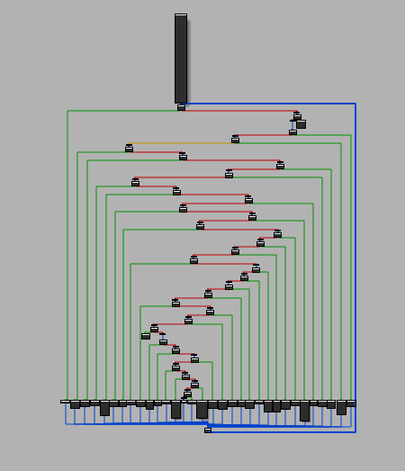

cd ~/MODeflattener/MODeflattener
python3 -m venv venv
source venv/bin/activate
pip install miasm pyparsing==2.4.7
## python modeflattener.py ... # 실행
pip install angr
pip install pyparsing==2.4.7 --force-reinstall
python -c "import angr, pyparsing; print('angr OK'), print('pyparsing version:', pyparsing.__version__)"


# Original modeflattener deobfuscation command 
# python3 modeflattener.py   ./samples/check_passwd_flat   ./samples/check_passwd_flat_deflatten   0x4009a0 -l DEBUG > dh_deflatten_log.txt 2>&1
# python3 modeflattener.py   ./samples/check_passwd_flat   ./samples/check_passwd_flat_deflatten   0x4009a0 -l DEBUG > dh_deflatten_log.txt 2>&1

python3 modeflattener.py \
    /home/dongho.lee/MODeflattener/MODeflattener/ll_file/cfgO0.flatten \
    /home/dongho.lee/MODeflattener/MODeflattener/ll_file/cfgO0.deflatten \
    > dh_test.txt


cpulimit -l 60 -- \
python3 modeflattener.py \
    /home/dongho.lee/MODeflattener/MODeflattener/ll_file/cfg.O0.flatten_binary \
    /home/dongho.lee/MODeflattener/MODeflattener/ll_file/deflattened_cfg.O0.flatten_binary3 \
    > dh_test.txt

80


modeflattener.py  and mod_utils.py  -> deflattening
====================================================================
(venv) dongho.lee@csec-gpuserver:~/MODeflattener/MODeflattener$ python3 modeflattener.py \
     /home/dongho.lee/MODeflattener/MODeflattener/ll_file/cfg.O0.flatten_binary \
     /home/dongho.lee/MODeflattener/MODeflattener/ll_file/deflattened_cfg.O0.flatten_binary \
     0x1e62 > dh_test.txt
[INFO] Architecture : x86_64
[INFO] bin_base_addr: 0x0

[INFO] found func @ 0x1e62 (0)
[ERROR] unable to deobfuscate func 0x1e62 (cff score = 0.000000)

[INFO] Deobfuscated file saved at '/home/dongho.lee/MODeflattener/MODeflattener/ll_file/deflattened_cfg.O0.flatten_binary' (Total Time Taken : 0.57 secs)
====================================================================


cfg.O0.flatten_1


이번에 되는거 
(venv) dongho.lee@csec-gpuserver:~/MODeflattener/MODeflattener$ python3 modeflattener.py \
>     ./ll_file/cfg_dh_1flatten_binary \
>     ./ll_file/cfg_dh_1flatten_binary_deflatten \
>     0x13ED > dh_deflatten_log.txt
[INFO] Architecture : x86_64
[INFO] bin_base_addr: 0x0
[INFO] found func @ 0x13ed (0)
[ERROR] unable to deobfuscate func 0x13ed (cff score = 0.000000)

[INFO] Deobfuscated file saved at './ll_file/cfg_dh_1flatten_binary_deflatten' (Total Time Taken : 0.20 secs)
(venv) dongho.lee@csec-gpuserver:~/MODeflattener/MODeflattener$ 


이전에 됏던거

(venv) dongho.lee@csec-gpuserver:~/MODeflattener/MODeflattener$ python3 modeflattener.py \
       /home/dongho.lee/MODeflattener/MODeflattener/ll_file/cfg.O0.flatten_1 \
       /home/dongho.lee/MODeflattener/MODeflattener/ll_file/deflattened_cfg.O0.flatten_binary_! \
       0x1e62 > dh_test.txt


[INFO] Architecture : x86_64
[INFO] bin_base_addr: 0x0
[INFO] found func @ 0x1e62 (0)
[ERROR] unable to deobfuscate func 0x1e62 (cff score = 0.000000)

[INFO] Deobfuscated file saved at '/home/dongho.lee/MODeflattener/MODeflattener/ll_file/deflattened_cfg.O0.flatten_binary_!' (Total Time Taken : 0.60 secs)


vi flatten_dot_parser.py
vi generate_deflattened_dot.py 


# MODeflattener
***Miasm's Ollvm Deflattener***  
> MODeflattener deobfuscates control flow flattened functions obfuscated by [OLLVM](https://github.com/obfuscator-llvm/obfuscator) using [Miasm](https://github.com/cea-sec/miasm).  
https://mrt4ntr4.github.io/MODeflattener/  

Flattened Flow             |  Deflattened Flow
:-------------------------:|:-------------------------:
  |  

## Installation
```
git clone https://github.com/mrT4ntr4/MODeflattener.git
cd MODeflattener
pip3 install -r requirements.txt
```

## Usage
```
└──╼ $python3 modeflattener.py -h
usage: modeflattener [-h] [-a] [-l LOG] filename patch_filename address

positional arguments:
  filename           file to deobfuscate
  patch_filename     deobfuscated file name
  address            obfuscated function address

optional arguments:
  -h, --help         show this help message and exit
  -a, --all          find functions recursively and deobfuscate if flattened
  -l LOG, --log LOG  logging level (default=INFO)
```

### Supported Architectures
- *x86*

### Bonus
- [Tim Blazytko's flattening heuristic script](https://gist.github.com/mrphrazer/da32217f231e1dd842986f94aa6d9d37)  
  While disassembling the specified function we can look out for other functions used by it and can make use of this script to automatically detect whether it is a flattened one and try to deobfuscate it. This has already been integrated into the tool!    
- [nop-hider idapython script](https://gist.github.com/JusticeRage/795badf81fe59454963a06070d132b06)  
    This script hides the nop instructions from IDA graph view as the backbone is converted into a long nop chain after deobfuscation.  


# References
[Dissecting LLVM Obfuscator - RPISEC](https://rpis.ec/blog/dissection-llvm-obfuscator-p1/)  


[Automated Detection of Control-flow Flattening - Tim Blazytko](https://synthesis.to/2021/03/03/flattening_detection.html)  


python3 modeflattener.py \
    /home/dongho.lee/MODeflattener/MODeflattener/ll_file/cfgO0.flatten \
    /home/dongho.lee/MODeflattener/MODeflattener/ll_file/cfgO0.deflatten \
    > dh_test.txt


python3 generate_deflattened_dot.py flattened_edges.dot deflattened_cfg.dot
dot -Tpng deflattened_cfg.dot -o deflattened_cfg.png


    python3 generate_deflattened_dot.py flattened_edges.dot deflattened_cfg.dot


modeflattener backup version
-rw-rw-r-- 1 dongho.lee dongho.lee   16874  7월 22 14:48 2025-07-22_modeflattener.py
-rw-rw-r-- 1 dongho.lee dongho.lee    9675  2월 11 13:16 modeflattener_2025-01-03.py 
-rw-rw-r-- 1 dongho.lee dongho.lee   11109  2월 11 13:16 modeflattener_2025-02-03.py
-rw-rw-r-- 1 dongho.lee dongho.lee   17492  2월 11 13:16 modeflattener_2025-02-04.py
-rw-rw-r-- 1 dongho.lee dongho.lee   21872  7월 27 17:35 modeflattener_2025-07-27_1.py
-rw-rw-r-- 1 dongho.lee dongho.lee   20327  7월 27 10:01 modeflattener_2025-07-27.py
-rw-rw-r-- 1 dongho.lee dongho.lee   26207  7월 28 15:35 modeflattener_2025-07-28_eax...r9.py
-rw-rw-r-- 1 dongho.lee dongho.lee   27441  7월 29 08:27 modeflattener_2025-07-29_1.py
-rw-rw-r-- 1 dongho.lee dongho.lee   25461  7월 29 07:06 modeflattener_2025-07-29.py
-rw-rw-r-- 1 dongho.lee dongho.lee   20126  8월  4 17:32 modeflattener_2025-08-04[1].py
-rw-rw-r-- 1 dongho.lee dongho.lee   20213  8월  4 17:18 modeflattener_2025-08-04.py
-rw-rw-r-- 1 dongho.lee dongho.lee   13357  8월  5 14:46 modeflattener_2025-08-05_1.py // 최종 마지막까지 진행하다가 멈춘건데 디스패처 찾고 분석 이어 나가려고 하는데 pre_dispatcher를 못찾아서 오늘중에 dispatcher랑 pre_dispacher 찾았던 코드로 돌아가서 분석 진행하려고함.  아마도 분석 이어서 진행하면 2025-08-05_2.py 코드로 만들듯함
-rw-rw-r-- 1 dongho.lee dongho.lee   12004  8월  5 13:32 modeflattener_2025_08-05_AMD64error.py // AMD64에러 났을떄 x86에서만 실행 가능했을떄  
-rw-rw-r-- 1 dongho.lee dongho.lee   24820  7월 28 11:06 modeflattener_2027-07-28[1_state_analysis].py
-rw-rw-r-- 1 dongho.lee dongho.lee   11430  8월  4 20:32 modeflattener_original.py
-rw-rw-r-- 1 dongho.lee dongho.lee    5923  8월  5 15:39  mod_utils_2025-08-05_2.py // 일단 여기까지는 dispatcher 찾고 pre_dispatcher 까지 찾음  (에러 메세지가 지금 relevant block 0x1265에서 state 값을 제대로 찾지 못한것 같음)
-->  python3 modeflattener.py     ./ll_file/cfg_dh_1flatten_binary     ./ll_file/cfg_dh_1flatten_binary_deflatten     0x13ED > dh_deflatten_log.txt

-rw-rw-r-- 1 dongho.lee dongho.lee   13031  8월  6 09:45  modeflattener_2025-08-06.py   // Modeflattener로 분석은 마무리 되었는데 patch 부분 손봐야함 


-rw-rw-r-- 1 dongho.lee dongho.lee   13031  8월  6 13:40  modeflattener_2025-08-06_1.py // 혹시 몰라서 백업해둠

명령어 :   python3 modeflattener.py ./ll_file/cfg_dh_1flatten_binary ./ll_file/cfg_dh_1flatten_binary_deflatten 0x13ED > dh_deflatten_log.txt 2>&1                  // log랑 print 둘다 한번에 dh_deflatten_log.txt로 보냄


-rw-rw-r-- 1 dongho.lee dongho.lee   13031  8월  7 10:19 modeflattener_2025-08-07.py  // dispatcher 찾고 비교하는 상수값 까지 찾은 상태  이 이후에 relevant_block 에 대해서 찾을거임


-rw-rw-r-- 1 dongho.lee dongho.lee    7057  8월  7 15:33 modeflattener_2025_08_07_1.py  // state 값 찾고 1개 patch에 대해서 deflattening 완료  ☆★☆★☆★☆  매우 중요 ★☆★☆★☆★☆★☆★
Control-flow 는 복원이 되었지만 binary는 제대로 실행 되지 않음. 고쳐야함 
-rw-r-- 1 dongho.lee dongho.lee    7057  8월  7 15:33 modeflattener_2025_08_07_1.py
-rw-rw-r-- 1 dongho.lee dongho.lee    8468  8월  7 15:33 mod_utils_2025_08_07_1.py

-rw-rw-r-- 1 dongho.lee dongho.lee    7763  8월  8 16:02 modeflattener_2025_08-08.py // 동적분석정보 활용해서 실행된 애들은 dispatcher 날리고 흐름이어주는 과정  그냥 백업


-rw-rw-r-- 1 dongho.lee dongho.lee   19639  8월 11 09:22 modeflattener_2025_08-11.py
-rw-rw-r-- 1 dongho.lee dongho.lee   12203  8월 11 09:23 mod_utils_2025_08-11.py
# gpt5 이용해서 dispatcher map 잡고 state -> target 맵 28개 찾고
# direct patch 적용해서 0x120F ->0x13B5 이런식으로 흐름 찾음
# cmov 조건 의존 블록 등 0x1265 , 0x1199 등 찾음  <- tail jmp 유지

-rw-rw-r-- 1 dongho.lee dongho.lee   19639  8월 11 09:22 modeflattener_2025_08-11_1.py
-rw-rw-r-- 1 dongho.lee dongho.lee   12203  8월 11 09:23 mod_utils_2025_08-11_1.py
# 현재 deflattening 일부 완료  29 dispatcher 에서 19 개 성공   [실행 O]


-rw-rw-r-- 1 dongho.lee dongho.lee   19639  8월 11 09:22 modeflattener_2025_08-11_2.py
-rw-rw-r-- 1 dongho.lee dongho.lee   12203  8월 11 09:23 mod_utils_2025_08-11_2.py
# 현재 deflattening 일부 완료  29 dispatcher 에서 23 개 성공  [실행 X] 

-rw-rw-r-- 1 dongho.lee dongho.lee   19639  8월 11 09:22 modeflattener_2025_08-11_3.py
-rw-rw-r-- 1 dongho.lee dongho.lee   12203  8월 11 09:23 mod_utils_2025_08-11_3.py
# 현재 deflattening 일부 완료 29 dispatcher 에서 19개 성공하고  19개는 nop 때림    일단은 이게 약간 최종 같은 느낌이네
# 일단은 jmp 부분 좀 지울 수 있는 방법하고 정적분석으로 알 수 있는 부분까지는 분석을 진행. 
# python3 modeflattener.py ./ll_file/cfg_dh_1flatten_binary ./ll_file/cfg_dh_1flatten_binary_deflatten 0x13ED > dh_deflatten_log.txt 2>&1

# 이거는 스모크가 같은지 확인하는 명령어 
# (venv) dongho.lee@csec-gpuserver:~/MODeflattener/MODeflattener$ python3 eqcheck.py --bin1 ./ll_file/cfg_dh_1flatten_binary \
   --bin2 ./ll_file/cfg_dh_1flatten_binary_deflatten \
   --seq-from -100 --seq-to 100 --rand 500


 python3 modeflattener.py ./ll_file/cfg_dh_1flatten_binary ./ll_file/cfg_dh_1flatten_binary_deflatten 0x13ED > dh_deflatten_log.txt 2>&1
 # flattening 적용된 binary 를 1flatten_binary_deflatten 으로 deobfuscation 진행한것

python3 modeflattener.py ./ll_file/cfg_dh_flatten_binary ./ll_file/cfg_dh_2flatten_binary_deflatten 0x1CA8 > dh_2deflatten_log.txt 2>&1
# 1 FLATTEING은 해서 2 FLATTENING 으로도 진행해보았는데 Control-flow 는 확실히 변화하였음. 분석하기 편함
# 이슈가 있음 큰 값을 입력하면 값이 달라짐  #2 flatten 적용햇을떄임   1로 다시 한번 해봐야겠음 

modeflattener_2025_08-12
mod_utils_2025_08-12           
# 일단 테스트 백업


-rw-rw-r-- 1 dongho.lee dongho.lee   19639  8월 11 09:22 modeflattener_2025_08-11_3.py
-rw-rw-r-- 1 dongho.lee dongho.lee   12203  8월 11 09:23 mod_utils_2025_08-11_3.py
# 일단 이걸로 flatteing 된 구조 일부는 풀렸고 랜덤으로 3000개 돌렸는데 동일한 결과
# 실행속도는 deflatteing된 바이너리가 빠름 [20-30%]
# 명령어수 flatten_binary =264개   deflatten_binary =378 


-rw-rw-r-- 1 dongho.lee dongho.lee   25490  8월 13 09:35 modeflattener_2025_08-13.py
-rw-rw-r-- 1 dongho.lee dongho.lee   19351  8월 13 09:35 mod_utils_2025_08-13.py
# 위와 동일한 결과임 즉 제대로 deflatteing 되는거를 볼 수 있음 


######################################################################
# 동적 지표를 보기 위해서 cargp로 설치
# B. cargo로 설치(Rust 필요)
# Rustup 설치
curl https://sh.rustup.rs -sSf | sh -s -- -y
source $HOME/.cargo/env

# hyperfine 설치
cargo install hyperfine
~/.cargo/bin/hyperfine --version
원하면 ~/.cargo/bin을 PATH에 추가하세요:
echo 'export PATH="$HOME/.cargo/bin:$PATH"' >> ~/.bashrc
source ~/.bashrc


# deflatteing 정적, 동적 결과

taskset -c 0 hyperfine -w 10 -r 100 \ 'echo 123 | ./ll_file/cfg_dh_1flatten_binary >/dev/null' \ 'echo 123 | ./ll_file/cfg_dh_1flatten_binary_deflatten >/dev/null'
taskset -c 0 hyperfine -w 5 -r 20 \ 'for i in {1..5000}; do echo 123 | ./ll_file/cfg_dh_1flatten_binary >/dev/null; done' \ 'for i in {1..5000}; do echo 123 | ./ll_file/cfg_dh_1flatten_binary_deflatten >/dev/null; done'
# 동적 실행 결과 deflattein이 더 빠름

objdump -d --disassemble=main ./ll_file/cfg_dh_1flatten_binary \ | grep -E '^[[:space:]]*[0-9a-f]+:' | wc -l
objdump -d --disassemble=main ./ll_file/cfg_dh_1flatten_binary_deflatten \ | grep -E '^[[:space:]]*[0-9a-f]+:' | wc -l
# main 함수 disassem 주소로 시작하하는 라인수

objdump -h ./ll_file/cfg_dh_1flatten_binary_deflatten | awk '/\.text/ {print "deflat .text size:", $3}' 
objdump -h ./ll_file/cfg_dh_1flatten_binary | awk '/\.text/ {print "deflat .text size:", $3}'
# 명령어 수 확인

/usr/bin/time -f "real %e" bash -c 'echo 123 | ./ll_file/cfg_dh_1flatten_binary >/dev/null' /usr/bin/time -f "real %e" bash -c 'echo 123 | ./ll_file/
# 1회 실행

cfg_dh_1flatten_binary_deflatten >/dev/null'
callgrind_annotate --inclusive=yes flat.out   | grep -m1 'main'
callgrind_annotate --inclusive=yes deflat.out | grep -m1 'main'
# 동적 명령어 비교 main 자신 + 하위 호출까지 포함한 누적 ir 수 (명령어 참조 수)

callgrind_annotate --inclusive=no  flat.out   | grep -m1 'main'
callgrind_annotate --inclusive=no  deflat.out | grep -m1 'main'
#

objdump -d --disassemble=main -M intel ./ll_file/cfg_dh_1flatten_binary   | grep -n '\<call' | nl
objdump -d --disassemble=main -M intel ./ll_file/cfg_dh_1flatten_binary_deflatten   | grep -n '\<call' | nl


callgrind_annotate --inclusive=yes  --threshold=0 flat.out   | grep -m1 '???:main'
callgrind_annotate --inclusive=yes  --threshold=0 deflat.out | grep -m1 '???:main'
callgrind_annotate --inclusive=no   --threshold=0 flat.out   | grep -m1 '???:main'
echo 123 | valgrind --tool=callgrind --callgrind-out-file=flat.out \./ll_file/cfg_dh_1flatten_binary
echo 123 | valgrind --tool=callgrind --callgrind-out-file=flat.out \./ll_file/cfg_dh_1flatten_binary_deflatten

callgrind_annotate flat.out   | head -n 40
callgrind_annotate deflat.out | head -n 40


